# 🌑 THE HYPER-AUTOMATED CINEMATIC AGENT

  

> *"In the loop, there is no beginning. Only the story."*

---

## 👁️ THE INFINITE LOOP PHILOSOPHY

This is not a bot. It is a **headless creative director**.
Designed for the age of short-form retention, this agent operates on a strict **Infinite Loop** protocol:

1.  **The Hook (0-8s)**: Fast-paced, kinetic visual extraction.
2.  **The Narrative (8-40s)**: A deep-dive tech noir monologue.
3.  **The Bridge (40-45s)**: The final sentence is semantically engineered to connect perfectly to the start of the video.

The result? A video that feels like it never ends.

---

## 📡 AUTONOMOUS WORKFLOW

```mermaid
graph TD
    A[⏰ 09:00 AM Trigger] -->|Wake Up| B(🧠 GEMINI 2.0 BRAIN)
    B -->|Draft Script| C{Creative Logic}
    C -->|Generate Prompts| D[🎨 FLUX IMAGE ENGINE]
    C -->|Synthesize Voice| E[🗣️ EDGE NEURAL TTS]
    D & E --> F[🎬 MOVIEPY STUDIO]
    F -->|Ken Burns Effect| F
    F -->|Color Grade: Noir| F
    F -->|Render 4K| G[🎥 FINAL MASTER]
    G -->|OAuth 2.0| H[🔴 YOUTUBE UPLOAD]
    G -->|Graph API| I[🟣 INSTAGRAM REEL]
    I -->|Sleep| A
```



---

## 🛠️ TECH STACK

| Component | Technology | Role |
| :--- | :--- | :--- |
| **The Brain** | `Google Gemini 2.0 Flash` | Scriptwriting & Visual Direction |
| **Failover** | `Groq (Llama-3.70b)` | Backup Intelligence |
| **The Eye** | `Pollinations (Flux.1)` | Cinematic Asset Generation |
| **The Studio** | `MoviePy` | NLE, Grading, VFX, Typography |
| **The Voice** | `Edge TTS` | Neural Speech Synthesis (Christopher Model) |
| **The Clock** | `APScheduler` | Cron-based Mission Triggering |

---

## 📂 REPOSITORY ARCHITECTURE

```bash
/
├── services/               # The Agent's Skills
│   ├── gemini_gen.py       # Creative Director (AI)
│   ├── social_youtube.py   # The Editor & Broadcaster
│   └── social_insta.py     # The Social Manager
├── assets/                 # (GitIgnored) Real-time generation buffer
├── logs/                   # Mission reports and audit trails
├── docs/                   # System protocols
├── scheduler.py            # The Heartbeat
├── trigger_morning.py      # Manual Override Switch
└── SYSTEM_AUDIT_REPORT.md  # Operational Constitution
```

---

## 🔌 SETUP GUIDE

### Prerequisites
*   Python 3.10+
*   FFmpeg installed and in PATH
*   Google Cloud Project (YouTube Data API enabled)

### Initialization

1.  **Clone the Construct**
    ```bash
    git clone https://github.com/StartUp-Satya/Hyper-Automated-Cinematic-Agent.git
    cd Hyper-Automated-Cinematic-Agent
    ```

2.  **Install Dependencies**
    ```bash
    pip install -r requirements.txt
    ```

3.  **Configure Environment**
    Copy `.env.example` to `.env` and inject your keys:
    ```ini
    GOOGLE_API_KEY=...
    INSTAGRAM_ACCESS_TOKEN=...
    ```

4.  **Authenticate**
    Place your YouTube `token.json` in the root directory.

---

## 🚀 DEPLOYMENT

### Manual Test Run
To force a monolithic generation cycle immediately:
```bash
python trigger_morning.py
```

### Autonomous Mode
To activate the persistent scheduler:
```bash
python main.py
```

---

*System Status: ALL GREEN.*
*End of Line.*
